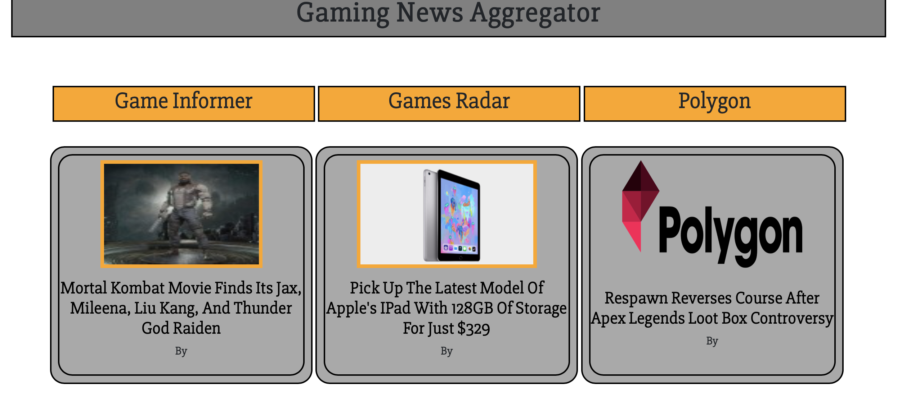

# gaming-news-aggregator

## Description
This is a single-page web application to serve as a gaming news aggregator. I have selected four top web sources <br> 
for obtaining game related news: Game Informer, Gamasutra, Polygon, and Games Radar. I personally wanted to <br> 
create this application for my own use since I am often behind in what's going on in the gaming world. <br>
Hopefully, this could be useful to others as well so that obtaining the most recent news does not have <br>
to be time consuming or annoying. All of the "hard work" has been done for you, and for each news source, <br>
the twenty most recent articles posted on the site have been scraped and are displayed to the app's frontend.

## Technologies Used

<ul>
  <li>Python</li>
  <li>Flask</li>
  <li>HTML</li>
  <li>CSS</li>
  <li>Jinja2 Templating</li>
  <li>BootStrap</li>
  <li>Scrapy Framework</li>
</ul>

## Screenshot


## Running

```
$ cd gamingNewsAggregator
$ python3 routes.py
```

## Future Improvements
<ul>
  <li>Improve GameInformer Image Quality</li>
  <li>Polygon Images Encoded in Base64</li>
  <li>Fix the Authors</li>
  <li>Make CSS Responsive</li>
</ul>

## Author
Alyssa Romero <br>
Last Updated: 25 Aug 2019
